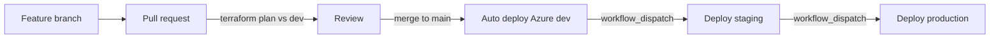
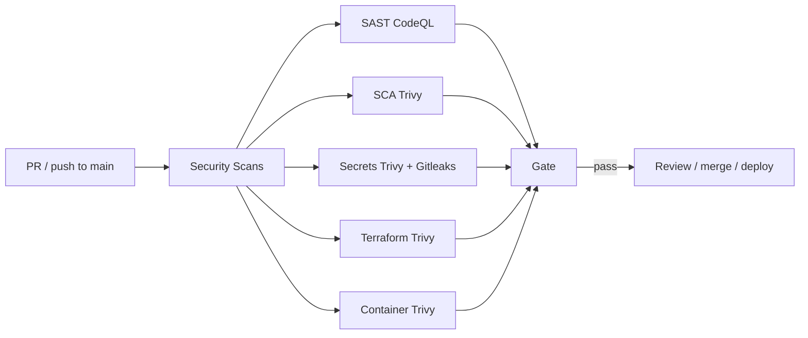

# Crypto Trading Dashboard

Paper-trading dashboard (Next.js) with JWT auth and Postgres history, deployed on **Azure** via Terraform and GitHub Actions.

**Live (dev):** [https://dev.gindri.com](https://dev.gindri.com)

---

## Architecture

| Layer | Choice |
|-------|--------|
| App | Next.js dashboard (`dashboard/`) |
| Auth | Email/password → JWT + bcrypt, stored in Postgres |
| Data | Azure Database for PostgreSQL Flexible Server |
| Compute | Azure Container Apps |
| Images | Azure Container Registry (ACR) |
| IaC | Terraform in `azure/` (Blob state per env) |
| CI/CD | GitHub Actions — **Azure Deploy** |

Environments: `dev` (auto on merge to `main`), `staging` and `production` (manual workflow).



---

## DevSecOps

Workflow: **Security Scans** (`.github/workflows/Security Scans.yml`) on every PR and push to `main`.  
Deploy also re-scans the image with Trivy before pushing to ACR.

| Layer | Tool | What it covers | Fails on |
|-------|------|----------------|----------|
| **SAST** | CodeQL | JS/TS application source (`dashboard/`) | CodeQL alerts |
| **SCA** | Trivy (fs / vuln) | npm dependencies in `dashboard/` | CRITICAL, HIGH |
| **Secrets** | Trivy (secret) + Gitleaks | Keys, tokens, passwords in the repo | CRITICAL–MEDIUM / Gitleaks |
| **Terraform / IaC** | Trivy (config) | Misconfig in `azure/` Terraform | CRITICAL, HIGH |
| **Container** | Trivy (image) | Built dashboard image (vuln + secret + misconfig) | CRITICAL, HIGH |



### Goals

- Shift security left in the SSDLC  
- Automate detection on PRs and deploys  
- Block on Critical / High (and secret findings)

### Branch protection (recommended)

On `main`: require a pull request; require status checks from **Security Scans** (all jobs) and **Terraform Plan (Azure)**; block direct pushes.

---

## Multi-environment Azure deploy

| Trigger | Environment | Behavior |
|---------|-------------|----------|
| PR to `main` | — | Security Scans + `terraform plan` (Azure `dev`) |
| Merge/push to `main` | `dev` | Security Scans + apply + image scan + ACR push + Container App |
| **Actions → Azure Deploy → Run workflow** | `staging` / `production` | Manual apply (image scanned before push) |

Legacy AWS tear-down (if anything remains): **AWS Destroy** (`workflow_dispatch` only).

### GitHub setup (once)

**Settings → Environments**

1. `dev` — no required reviewers  
2. `staging` — gate is manual Run workflow  
3. `production` — Required reviewers; deployment branches = `main`

**Repo secrets**

| Secret | Purpose |
|--------|---------|
| `ARM_CLIENT_ID` | Azure service principal |
| `ARM_CLIENT_SECRET` | SP password |
| `ARM_SUBSCRIPTION_ID` | Subscription |
| `ARM_TENANT_ID` | Entra tenant |

Optional (AWS Destroy only): `AWS_ACCESS_KEY_ID`, `AWS_SECRET_ACCESS_KEY`

### Day-to-day

1. Open a PR → plan + security checks pass → merge  
2. Merge auto-deploys **dev**  
3. Promote: **Azure Deploy** → `staging`, then `production` (approve gate)

### Terraform layout

| Path | Purpose |
|------|---------|
| `azure/backends/<env>.hcl` | Azure Blob state key |
| `azure/envs/<env>.tfvars` | `environment`, `location` |
| `azure/main.tf` | RG, ACR, Postgres, Log Analytics, Container Apps |

```bash
cd azure

terraform init -reconfigure -backend-config=backends/dev.hcl
terraform plan  -var-file=envs/dev.tfvars
terraform apply -var-file=envs/dev.tfvars

# staging / production: swap backends/*.hcl and envs/*.tfvars
```

Always use `-reconfigure` when switching environments.

### Custom domain (dev)

Already configured for **dev.gindri.com**. For another hostname:

1. **CNAME** `dev` → Container Apps FQDN (`terraform output dashboard_url` host)  
2. **TXT** `asuid.dev` → value from  
   `az containerapp show -n <app> -g <rg> --query properties.customDomainVerificationId -o tsv`  
3. Bind + managed cert:

```bash
az containerapp hostname add  -n crypto-trading-dev-app -g crypto-trading-dev --hostname dev.gindri.com
az containerapp hostname bind -n crypto-trading-dev-app -g crypto-trading-dev \
  --hostname dev.gindri.com --environment crypto-trading-dev-cae --validation-method CNAME
```

### Auth & data

- **Accounts:** email/password (JWT + bcrypt)  
- **History:** cash, holdings, and trades per user in that env’s Postgres DB  
