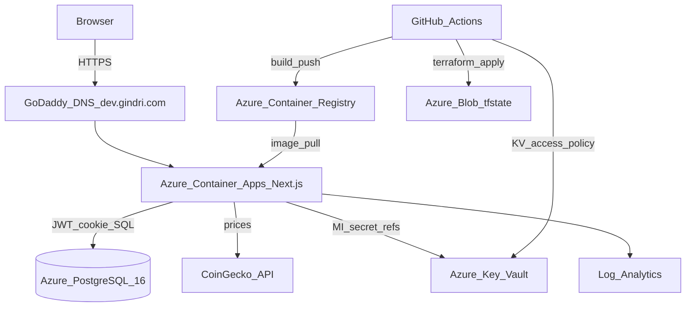
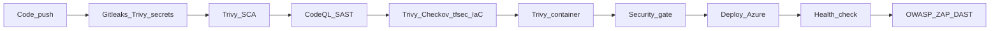

# Crypto Trading Dashboard — Azure DevSecOps Showcase

> Production-style **paper-trading** dashboard on **Azure** — Next.js, Postgres, Terraform, and a full shift-left CI/CD security pipeline (SAST, SCA, secrets, IaC, container, DAST).

**Live (dev):** [https://dev.gindri.com](https://dev.gindri.com)  
**Repo:** [github.com/gindriliunas/crypto-trading](https://github.com/gindriliunas/crypto-trading)

Built as an **Azure** DevSecOps portfolio piece — live URL, Terraform multi-env, and a full shift-left security pipeline.

---

## Architecture



| Layer | Choice |
|-------|--------|
| App | Next.js (TypeScript) paper trading + JWT/bcrypt auth |
| Data | Azure Database for PostgreSQL Flexible Server |
| Secrets | Azure Key Vault + user-assigned managed identity |
| Compute | Azure Container Apps (HTTPS + custom domain) |
| Images | Azure Container Registry |
| IaC | Terraform (`azure/`) — Blob state per env |
| CI/CD | GitHub Actions — Security Scans + Azure Deploy |

Environments: **dev** (auto on merge to `main`), **staging** / **production** (manual promote).

---

## DevSecOps pipeline



| Layer | Tool | Fails on |
|-------|------|----------|
| Secrets | Gitleaks + Trivy secret | Secret findings |
| SCA | Trivy fs (`dashboard/`) | CRITICAL, HIGH |
| SAST | CodeQL (JS/TS) | CodeQL alerts |
| IaC | Trivy + **Checkov** + **tfsec** | CRITICAL / HIGH |
| Container | Trivy image (+ re-scan before ACR push) | CRITICAL, HIGH |
| DAST | **OWASP ZAP** baseline vs live URL | Soft on PR; **blocking** after deploy to `dev` |

SARIF uploads land in the GitHub **Security** tab. Full gate notes: [docs/devsecops-pipeline.md](docs/devsecops-pipeline.md).

### Branch protection (**enabled**)

`main` requires a pull request (no direct push), blocks force-pushes, and requires these status checks before merge:

- Security Scans: SAST, SCA, Secrets, IaC, Container, Security gate summary  
- Azure Deploy: Terraform Plan (Azure)  

DAST after deploy runs on push to `main` once Azure Deploy finishes (not a merge check).

---

## Findings & fixes

Real gate failures from this repo and how they were remediated (portfolio evidence — not a checklist of pretend green builds).

### Container (Trivy image)

| Finding | Severity | Fix |
|---------|----------|-----|
| Alpine `libcrypto3` / `libssl3` (OpenSSL QUIC DoS) | HIGH | `apk upgrade --no-cache` in runtime stage |
| Unused Node-bundled `npm` toolchain (`tar`, `brace-expansion`, …) | CRITICAL / HIGH | Strip `npm` / `yarn` / `corepack` from the runner image |

Detail: [docs/container-hardening.md](docs/container-hardening.md).

### IaC / Azure (Trivy + Checkov + deploy)

| Finding | Fix |
|---------|-----|
| ACR / Postgres / KV “public surface” Checkov fails | Documented skips in `azure/.checkov.yaml` with residual risk (private endpoints later) |
| Trivy `AZU-0013` Key Vault network deny blocking CI | KV network ACL **Allow** so GitHub Actions can write secrets (trade-off vs private endpoint + self-hosted runner) |
| Key Vault RBAC `roleAssignments/write` 403 for Contributor SP | Switched to **access policies** Get/List for the Container Apps UAI |
| Terraform state lock races on concurrent plans | `-lock-timeout` on plan/apply |
| Dependabot PRs with empty `ARM_*` + wrong `azure/` cwd | Skip plan when credentials are empty; run skip from **workspace root** |

### App secrets

| Finding | Fix |
|---------|-----|
| `DATABASE_URL` / `JWT_SECRET` / invite as plaintext Container App secrets | Move to **Key Vault**; inject via **user-assigned MI** secret references |

### DAST (OWASP ZAP — exit code 2 / WARN-NEW)

ZAP’s Docker action reports *“Scan action failed… exit code 2”* when it finds **WARN-NEW** alerts (not a broken Docker install).

| Finding | Fix |
|---------|-----|
| Missing CSP, HSTS, X-Frame-Options, X-Content-Type-Options, Permissions-Policy | Security headers in `dashboard/next.config.ts` |
| CSP wildcards (`https:`, `*.coingecko.com`) | Explicit hosts: `coin-images.coingecko.com`, `api.coingecko.com` |
| CSP `script-src 'unsafe-eval'` | Removed (not required for Next.js production) |
| CSP `'unsafe-inline'` (App Router without nonce middleware) | Accepted + `10055` IGNORE in `.zap/rules.tsv` |
| Noise: Sec-Fetch-*, Base64 in assets, SQL false positive, cache/COOP informational | Documented IGNORE rules in `.zap/rules.tsv` |

Post-deploy ZAP against [https://dev.gindri.com](https://dev.gindri.com) is now a **blocking** gate on `main`.

### Process / SDLC

| Finding | Fix |
|---------|-----|
| `main` mergeable without proof of scans | Branch protection with required status checks |
| No structured threat model | [docs/threat-model-stride.md](docs/threat-model-stride.md) |

---

## Tech stack

```
Next.js · TypeScript · Tailwind
Azure Container Apps · ACR · PostgreSQL Flexible Server · Key Vault · Log Analytics
Terraform · GitHub Actions · Dependabot
CodeQL · Trivy · Checkov · tfsec · Gitleaks · OWASP ZAP
```

---

## Auth (app)

1. Invite signup (`SIGNUP_INVITE_CODE`) or local `ALLOW_PUBLIC_SIGNUP`  
2. Password: **min 12** + common-password deny list; bcrypt in Postgres  
3. Login lockout: **10** failures → **15** minutes  
4. JWT in httpOnly cookie `paper_id_token` (7d); TLS to Postgres (`sslmode=require`)

---

## Compliance mapping (gap analyses)

| Framework | Doc |
|-----------|-----|
| Cyber Essentials v3.3 | [docs/cyber-essentials.md](docs/cyber-essentials.md) |
| ISO/IEC 27001:2022 | [docs/ISO27001.md](docs/ISO27001.md) |
| Firewall rule register | [azure/FIREWALL_RULES.md](azure/FIREWALL_RULES.md) |
| Container hardening write-up | [docs/container-hardening.md](docs/container-hardening.md) |
| STRIDE threat model | [docs/threat-model-stride.md](docs/threat-model-stride.md) |
| Pipeline gate map | [docs/devsecops-pipeline.md](docs/devsecops-pipeline.md) |
| HLD / data flows | [docs/hld.md](docs/hld.md) |

These are **readiness / gap analyses**, not certification claims.

---

## Multi-environment deploy

| Trigger | Environment | Behavior |
|---------|-------------|----------|
| PR → `main` | — | Security Scans + `terraform plan` (dev) |
| Push → `main` | `dev` | Scans + apply + image scan + ACR + Container App + **ZAP DAST** |
| Actions → **Azure Deploy** | `staging` / `production` | Manual promote |

**Secrets:** `ARM_CLIENT_ID`, `ARM_CLIENT_SECRET`, `ARM_SUBSCRIPTION_ID`, `ARM_TENANT_ID`

```bash
cd azure
terraform init -reconfigure -backend-config=backends/dev.hcl
terraform plan  -var-file=envs/dev.tfvars
terraform apply -var-file=envs/dev.tfvars
```

---

## Skills demonstrated

| Skill | How this repo shows it |
|-------|------------------------|
| Azure cloud architecture | Container Apps, ACR, Flexible Server, Key Vault + MI, Log Analytics |
| Infrastructure as Code | Multi-env Terraform + remote Blob state + lock-timeout |
| DevSecOps pipelines | Six-layer GitHub Actions gate + SARIF + post-deploy ZAP |
| Finding → fix loop | Container CVEs, ZAP headers/CSP, KV access policy, Dependabot CI |
| Container security | Non-root image, apk upgrade, strip unused npm, Trivy gate |
| Secure SDLC / compliance | CE + ISO27001 mapping + STRIDE |
| Multi-env promotion | Trunk-based `dev` → manual staging/prod |

---

_Built by Gintas Indriliunas · [Projects hub](https://github.com/gindriliunas/projects)_
