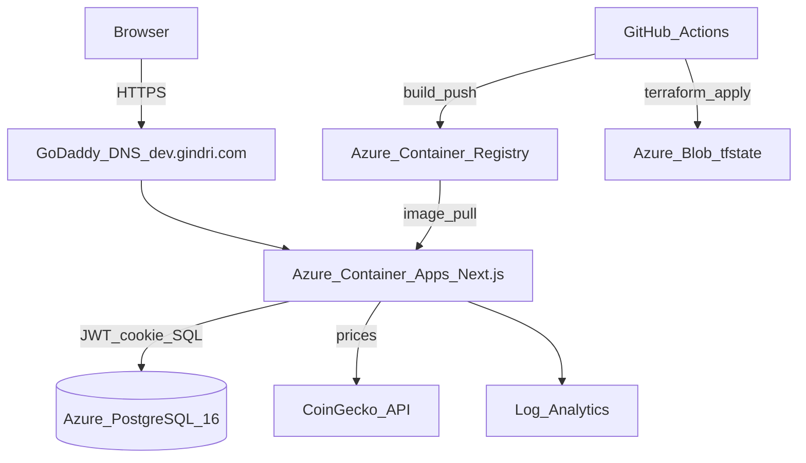
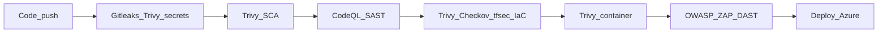

# Crypto Trading Dashboard — Azure DevSecOps Showcase

> Production-style **paper-trading** dashboard on **Azure** — Next.js, Postgres, Terraform, and a full shift-left CI/CD security pipeline (SAST, SCA, secrets, IaC, container, DAST).

**Live (dev):** [https://dev.gindri.com](https://dev.gindri.com)  
**Repo:** [github.com/gindriliunas/crypto-trading](https://github.com/gindriliunas/crypto-trading)

Built as a multi-cloud DevSecOps portfolio piece (Azure) alongside AWS projects — same shift-left philosophy, different cloud.

---

## Architecture



| Layer | Choice |
|-------|--------|
| App | Next.js (TypeScript) paper trading + JWT/bcrypt auth |
| Data | Azure Database for PostgreSQL Flexible Server |
| Compute | Azure Container Apps (HTTPS + custom domain) |
| Images | Azure Container Registry |
| IaC | Terraform (`azure/`) — Blob state per env |
| CI/CD | GitHub Actions — Security Scans + Azure Deploy |

Environments: **dev** (auto on merge to `main`), **staging** / **production** (manual promote).

---

## DevSecOps pipeline



| Layer | Tool | Fails on |
|-------|------|----------|
| Secrets | Gitleaks + Trivy secret | Secret findings |
| SCA | Trivy fs (`dashboard/`) | CRITICAL, HIGH |
| SAST | CodeQL (JS/TS) | CodeQL alerts |
| IaC | Trivy + **Checkov** + **tfsec** | CRITICAL / HIGH |
| Container | Trivy image (+ re-scan before ACR push) | CRITICAL, HIGH |
| DAST | **OWASP ZAP** baseline vs live URL | High (blocking on `main`) |

SARIF uploads land in the GitHub **Security** tab. Full gate notes: [docs/devsecops-pipeline.md](docs/devsecops-pipeline.md).

### Branch protection (recommended)

Require PR into `main`; require **Security Scans** jobs + **Terraform Plan (Azure)**; block direct pushes.

---

## Tech stack

```
Next.js · TypeScript · Tailwind
Azure Container Apps · ACR · PostgreSQL Flexible Server · Log Analytics
Terraform · GitHub Actions · Dependabot
CodeQL · Trivy · Checkov · tfsec · Gitleaks · OWASP ZAP
```

---

## Auth (app)

1. Invite signup (`SIGNUP_INVITE_CODE`) or local `ALLOW_PUBLIC_SIGNUP`  
2. Password: **min 12** + common-password deny list; bcrypt in Postgres  
3. Login lockout: **10** failures → **15** minutes  
4. JWT in httpOnly cookie `paper_id_token` (7d); TLS to Postgres (`sslmode=require`)

---

## Compliance mapping (gap analyses)

| Framework | Doc |
|-----------|-----|
| Cyber Essentials v3.3 | [docs/cyber-essentials.md](docs/cyber-essentials.md) |
| ISO/IEC 27001:2022 | [docs/ISO27001.md](docs/ISO27001.md) |
| Firewall rule register | [azure/FIREWALL_RULES.md](azure/FIREWALL_RULES.md) |
| Container hardening write-up | [docs/container-hardening.md](docs/container-hardening.md) |
| HLD / data flows | [docs/hld.md](docs/hld.md) |

These are **readiness / gap analyses**, not certification claims.

---

## Multi-environment deploy

| Trigger | Environment | Behavior |
|---------|-------------|----------|
| PR → `main` | — | Security Scans + `terraform plan` (dev) |
| Push → `main` | `dev` | Scans + apply + image scan + ACR + Container App |
| Actions → **Azure Deploy** | `staging` / `production` | Manual promote |

**Secrets:** `ARM_CLIENT_ID`, `ARM_CLIENT_SECRET`, `ARM_SUBSCRIPTION_ID`, `ARM_TENANT_ID`

```bash
cd azure
terraform init -reconfigure -backend-config=backends/dev.hcl
terraform plan  -var-file=envs/dev.tfvars
terraform apply -var-file=envs/dev.tfvars
```

---

## Skills demonstrated

| Skill | How this repo shows it |
|-------|------------------------|
| Azure cloud architecture | Container Apps, ACR, Flexible Server, Log Analytics |
| Infrastructure as Code | Multi-env Terraform + remote Blob state |
| DevSecOps pipelines | Six-layer GitHub Actions gate + SARIF |
| Container security | Non-root image, apk upgrade, Trivy gate |
| Secure SDLC / compliance | CE + ISO27001 mapping docs |
| Multi-env promotion | Trunk-based `dev` → manual staging/prod |

---

_Built by Gintas Indriliunas · [Projects hub](https://github.com/gindriliunas/projects)_
