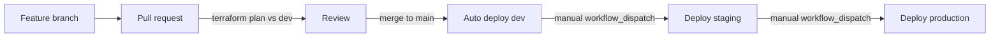

# DevSecOps Projects Overview.

## Introduction
This security document outlines a DevSecOps project implementation incorporating Static Application Security Testing (SAST), Software Composition Analysis (SCA), and Infrastructure as Code (IaC) scanning best practices on applications running within AWS infrastrcuture, utilising GitHub Actions with workflows.

## Project Goal
- Implement security measures throughout the software development lifecycle, creating a Secure Software Development Life Cycle (SSDLC).
- Automate security testing to identify vulnerabilities early in the development process, shifting security left.
- Integrate security into the CI/CD pipeline for continuous security monitoring.
- Ensure compliance with security best practices and industry standards.
- Enable PR blocking for Critical and High Vulnerabilities.

## Components
### 1. Infrastructure as Code (IaC) Scanning
IaC scanning ensures that the infrastructure configuration code adheres to security best practices and compliance standards. It helps in identifying misconfigurations and security loopholes in cloud infrastructure.

#### Tools:
- **Terraform Compliance**: Assesses Terraform scripts against security policies defined using BDD-style language to ensure compliance.
- **Trivy**: Provides automated IaC scanning to identify security misconfigurations across AWS, Azure, and GCP cloud environments.

### 2. Static Application Security Testing (SAST)
SAST involves analyzing the application's source code or binary code without executing it. This is done to identify security vulnerabilities, coding errors, and other issues in the codebase

#### Tools:
- **CodeQl**: Provides static code analysis to identify bugs, vulnerabilities, and code smells in various programming languages.

### 3. Software Composition Analysis (SCA)
SCA focuses on identifying and managing open-source components and third-party libraries used in the application. It helps in detecting known vulnerabilities in dependencies.

#### Tools:
- **Trivy**: Scans project dependencies and identifies vulnerabilities based on the National Vulnerability Database (NVD) and other sources.

1. **Integration with CI/CD Pipeline**: Incorporate SAST, SCA, and IaC scanning tools into the CI/CD pipeline to automate security testing.
2. **Pre-commit and Post-commit Hooks**: Implement pre-commit hooks to trigger security scans before code is merged into the main branch. Also, execute post-commit hooks to perform additional security checks after code deployment.
3. **Custom Policies**: Define custom security policies based on project requirements and industry standards to ensure comprehensive security coverage.
4. **Automated Remediation**: Configure automated remediation processes to fix identified vulnerabilities or misconfigurations whenever possible.
5. **Reporting and Notifications**: Generate detailed reports on security findings and send notifications to relevant stakeholders for prompt remediation.

## Conclusion
By integrating SAST, SCA, and IaC scanning practices into the DevSecOps pipeline, the project aims to enhance the security posture of the running applications in AWS, reducing vulnerabilities, and ensure compliance throughout the software development lifecycle.

## Multi-environment AWS deploy (dev / staging / production)

Single AWS account, separate Terraform state per environment. Trunk-based flow on `main`.

| Trigger | Environment | Behavior |
|---------|-------------|----------|
| PR to `main` | — | `terraform plan` against **dev** |
| Merge/push to `main` | `dev` | Auto `terraform apply` |
| Actions → **AWS Deploy** → Run workflow → `staging` | `staging` | Manual apply |
| Actions → **AWS Deploy** → Run workflow → `production` | `production` | Manual apply (after Environment approval) |



### GitHub Environments setup (required once)

In the repo: **Settings → Environments**, create:

1. **`dev`** — no required reviewers (auto-deploy from `main`)
2. **`staging`** — no required reviewers (gate is manual Run workflow)
3. **`production`** — enable **Required reviewers** (add yourself), and under **Deployment branches** restrict to `main`

Repo secrets (or the same secrets on each Environment):

- `AWS_ACCESS_KEY_ID`
- `AWS_SECRET_ACCESS_KEY`

### Promote day to day

1. Open a PR → wait for Terraform plan (and SAST) to pass → merge
2. Merge deploys **dev** automatically
3. When ready: **Actions** → **AWS Deploy** → **Run workflow** → select **staging**
4. When ready: **Run workflow** → select **production** → approve the Environment gate if prompted

### Terraform layout

| Path | Purpose |
|------|---------|
| `backends/<env>.hcl` | S3 state key per env (`env/dev/...`, `env/staging/...`, `env/production/...`) |
| `envs/<env>.tfvars` | Non-secret env vars (`environment`, `aws_region`, `vpc_cidr`) |
| `main.tf` | Env-scoped app data bucket; shared state bucket is bootstrap only |
| `network.tf` / `ecr.tf` / `apprunner.tf` | VPC (public + private + NAT), ECR, App Runner |
| `cognito.tf` / `rds.tf` | User pool (login) + Postgres for per-user paper trade history |

The dashboard lives in `dashboard/`. Merge to `main` builds the image, pushes it to ECR, and deploys **App Runner** (0.25 vCPU / 512 MB) with a VPC connector to private RDS. After apply, Terraform output `dashboard_url` is the public **HTTPS** URL.

**Custom domain:** point a CNAME (e.g. `dev.gindri.com`) at the App Runner hostname from `apprunner_service_url` (not the old ALB).

**Accounts:** Cognito email/password. **History:** each signed-in user’s cash, holdings, and trades are stored in that environment’s RDS database (not in the browser).

### Local Terraform commands

```bash
# Dev
terraform init -reconfigure -backend-config=backends/dev.hcl
terraform plan -var-file=envs/dev.tfvars
terraform apply -var-file=envs/dev.tfvars

# Staging
terraform init -reconfigure -backend-config=backends/staging.hcl
terraform plan -var-file=envs/staging.tfvars
terraform apply -var-file=envs/staging.tfvars

# Production
terraform init -reconfigure -backend-config=backends/production.hcl
terraform plan -var-file=envs/production.tfvars
terraform apply -var-file=envs/production.tfvars
```

Switching environments locally always needs `-reconfigure` so Terraform picks up the other state key.

### Branch protection (recommended)

On `main`: require a pull request, require status checks (SAST + Terraform plan), block direct pushes.

# DevSecOps Project Diagram

```mermaid
flowchart LR
    A[GitHub Repos] --> B{CI/CD Pipeline GH Actions}
    B --> C[SAST]
    B --> D[SCA]
    B --> E[IaC Scanning]
    C --> F[Static Code Analysis]
    D --> G[Dependency Check]
    E --> H[Infrastructure Configuration]
    F --> I[Code Vulnerabilities]
    G --> J[Dependency Vulnerabilities]
    H --> K[Infrastructure Misconfigurations]
    I --> L[Remediation Actions]
    J --> L
    K --> L
    L --> M[Reporting and Notifications]
    M --> N[Development Team]
    M --> O[Security Team]