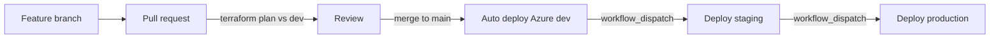
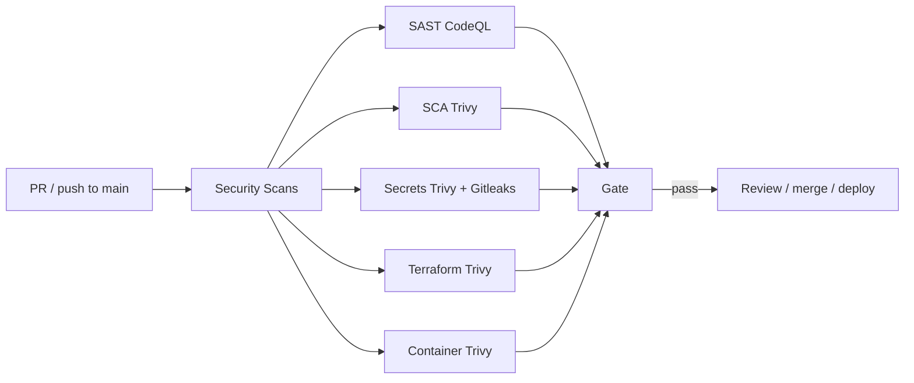

# Crypto Trading Dashboard

Paper-trading dashboard (Next.js) with JWT auth and Postgres history, deployed on **Azure** via Terraform and GitHub Actions.

**Live (dev):** [https://dev.gindri.com](https://dev.gindri.com)

---

## Architecture

| Layer | Choice |
|-------|--------|
| App | Next.js dashboard (`dashboard/`) |
| Auth | Email/password → JWT + bcrypt, stored in Postgres |
| Data | Azure Database for PostgreSQL Flexible Server |
| Compute | Azure Container Apps |
| Images | Azure Container Registry (ACR) |
| IaC | Terraform in `azure/` (Blob state per env) |
| CI/CD | GitHub Actions — **Azure Deploy** |

Environments: `dev` (auto on merge to `main`), `staging` and `production` (manual workflow).



---

## DevSecOps

Workflow: **Security Scans** (`.github/workflows/Security Scans.yml`) on every PR and push to `main`.  
Deploy also re-scans the image with Trivy before pushing to ACR.

| Layer | Tool | What it covers | Fails on |
|-------|------|----------------|----------|
| **SAST** | CodeQL | JS/TS application source (`dashboard/`) | CodeQL alerts |
| **SCA** | Trivy (fs / vuln) | npm dependencies in `dashboard/` | CRITICAL, HIGH |
| **Secrets** | Trivy (secret) + Gitleaks | Keys, tokens, passwords in the repo | CRITICAL–MEDIUM / Gitleaks |
| **Terraform / IaC** | Trivy (config) | Misconfig in `azure/` Terraform | CRITICAL, HIGH |
| **Container** | Trivy (image) | Built dashboard image (vuln + secret + misconfig) | CRITICAL, HIGH |



### Goals

- Shift security left in the SSDLC  
- Automate detection on PRs and deploys  
- Block on Critical / High (and secret findings)

### Branch protection (recommended)

On `main`: require a pull request; require status checks from **Security Scans** (all jobs) and **Terraform Plan (Azure)**; block direct pushes.

### Container scan findings and fix

Trivy’s **container** job initially failed on the `node:22-alpine` runtime image. App npm packages in `dashboard/` were clean; findings were in the **base image**.

#### Alpine OS (2 × HIGH)

| Package | CVE | Issue | Fix |
|---------|-----|--------|-----|
| `libcrypto3` / `libssl3` | CVE-2026-14456 | OpenSSL QUIC DoS (unbounded memory) | `apk upgrade --no-cache` in the runtime stage (`3.5.7-r0` → `3.5.8-r0`) |

#### Bundled Node toolchain (1 × CRITICAL, 10 × HIGH)

Located under `/usr/local/lib/node_modules/npm/` inside the Node image — **not** used by the production Next.js standalone server (`node server.js`).

| Library | CVEs | Severity | Issue |
|---------|------|----------|--------|
| `tar` | CVE-2026-59873 | CRITICAL | DoS via crafted gzip bomb |
| `tar` | CVE-2026-59874, CVE-2026-73566 | HIGH | DoS via malformed / long-path archives |
| `brace-expansion` | CVE-2026-13149, CVE-2026-14257, CVE-2026-69152 | HIGH | DoS in pattern expansion |
| `pacote` | CVE-2026-9496 | HIGH | Vulnerability in npm package fetcher |
| `picomatch` | CVE-2026-33671 | HIGH | ReDoS via crafted extglob patterns |
| `ip-address` | CVE-2026-69192 | HIGH | Inconsistent IP parsing → SSRF risk |
| `sigstore` | CVE-2026-48815 | HIGH | Weak cert verification option handling |

**Remediation** (in `dashboard/Dockerfile` runner stage):

1. `apk upgrade --no-cache` — patch Alpine OpenSSL  
2. Remove unused `npm` / `yarn` / `corepack` from the runtime image so those toolchain CVEs are not shipped  

Commit: `60b11e9`.

---

## Cyber Essentials (v3.3)

Full readiness tables, MFA/device checklists, and 14-day patch SLA: **[docs/cyber-essentials.md](docs/cyber-essentials.md)**.  
Firewall rule register: **[azure/FIREWALL_RULES.md](azure/FIREWALL_RULES.md)**.

| Control | Project status (summary) |
|---------|--------------------------|
| Firewalls | **Partial** — HTTPS app + documented Postgres rules; device firewalls are Org |
| Secure configuration | **Partial / Aligns** — TLS, hardened image, JWT cookies; Key Vault optional |
| Security update management | **Aligns** (process) — Trivy gates + Dependabot + 14-day SLA |
| User access control | **Partial** — strong passwords, lockout, invite signup; **cloud MFA is Org (auto-fail if missing)** |
| Malware protection | **Org / Partial** — endpoint AV required on devices; non-root container |

---

## ISO/IEC 27001:2022

Clause 4–10 and Annex A alignment tables (what aligns vs what does not): **[docs/ISO27001.md](docs/ISO27001.md)**.

Technical controls (vuln management, IaC, TLS, SSDLC, env separation) are the strongest area. There is **no ISMS** yet (policy, risk assessment, Statement of Applicability, internal audit), so this is a gap analysis, not a certification claim.

| Theme | Aligns | Does not fully align |
|-------|--------|----------------------|
| ISMS (4–10) | Operational CI/CD | No policy, SoA, audit, or management review |
| A.5 Organizational | Auth secrets (bcrypt/JWT) | Policies, incident process, privacy programme |
| A.6 People | App account disable (`disabled_at`) | Screening, awareness, event reporting |
| A.7 Physical | Azure datacentres (PaaS) | Operator devices / home working (Org) |
| A.8 Technological | Trivy/CodeQL, Terraform, TLS, env split | Key Vault, private DB, app MFA, SIEM, restore drills |

---

## Multi-environment Azure deploy

| Trigger | Environment | Behavior |
|---------|-------------|----------|
| PR to `main` | — | Security Scans + `terraform plan` (Azure `dev`) |
| Merge/push to `main` | `dev` | Security Scans + apply + image scan + ACR push + Container App |
| **Actions → Azure Deploy → Run workflow** | `staging` / `production` | Manual apply (image scanned before push) |

### GitHub setup (once)

**Settings → Environments**

1. `dev` — no required reviewers  
2. `staging` — gate is manual Run workflow  
3. `production` — Required reviewers; deployment branches = `main`

**Repo secrets**

| Secret | Purpose |
|--------|---------|
| `ARM_CLIENT_ID` | Azure service principal |
| `ARM_CLIENT_SECRET` | SP password |
| `ARM_SUBSCRIPTION_ID` | Subscription |
| `ARM_TENANT_ID` | Entra tenant |

### Day-to-day

1. Open a PR → plan + security checks pass → merge  
2. Merge auto-deploys **dev**  
3. Promote: **Azure Deploy** → `staging`, then `production` (approve gate)

### Terraform layout

| Path | Purpose |
|------|---------|
| `azure/backends/<env>.hcl` | Azure Blob state key |
| `azure/envs/<env>.tfvars` | `environment`, `location`, optional `db_admin_cidrs` |
| `azure/main.tf` | RG, ACR, Postgres, Log Analytics, Container Apps |
| `azure/FIREWALL_RULES.md` | Inbound rule register (Cyber Essentials) |
| `docs/cyber-essentials.md` | CE v3.3 readiness + Org checklists |

```bash
cd azure

terraform init -reconfigure -backend-config=backends/dev.hcl
terraform plan  -var-file=envs/dev.tfvars
terraform apply -var-file=envs/dev.tfvars

# staging / production: swap backends/*.hcl and envs/*.tfvars
```

Always use `-reconfigure` when switching environments.

### Custom domain (dev)

Already configured for **dev.gindri.com**. For another hostname:

1. **CNAME** `dev` → Container Apps FQDN (`terraform output dashboard_url` host)  
2. **TXT** `asuid.dev` → value from  
   `az containerapp show -n <app> -g <rg> --query properties.customDomainVerificationId -o tsv`  
3. Bind + managed cert:

```bash
az containerapp hostname add  -n crypto-trading-dev-app -g crypto-trading-dev --hostname dev.gindri.com
az containerapp hostname bind -n crypto-trading-dev-app -g crypto-trading-dev \
  --hostname dev.gindri.com --environment crypto-trading-dev-cae --validation-method CNAME
```

### Auth & data

- **Accounts:** email/password (JWT + bcrypt), **min 12 characters** + common-password deny list  
- **Signup:** invite code required in Azure (`terraform output -raw signup_invite_code`)  
- **Lockout:** 10 failed logins → 15 minute lock  
- **Disable user:** `UPDATE users SET disabled_at = NOW() WHERE email = '...'`  
- **History:** cash, holdings, and trades per user in that env’s Postgres DB  

See [docs/cyber-essentials.md](docs/cyber-essentials.md) for MFA/device Org checklists.
