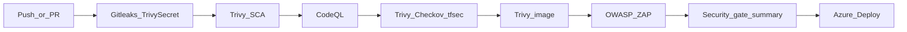

# DevSecOps pipeline (interview evidence)

Shift-left gates for the paper-trading dashboard. Workflow: `.github/workflows/Security Scans.yml`. Deploy also re-scans the image in `.github/workflows/Azure Deploy.yml` before ACR push.

**Live target for DAST:** https://dev.gindri.com

## Gate map

| Order | Layer | Tool | Scope | Fails on |
|------:|-------|------|-------|----------|
| 1 | Secrets | Gitleaks + Trivy secret | Whole repo | Secret findings (CRITICAL–MEDIUM Trivy) |
| 2 | SCA | Trivy filesystem | `dashboard/` | CRITICAL, HIGH (unfixed ignored) |
| 3 | SAST | CodeQL | JS/TS (`dashboard/`) | CodeQL alerts |
| 4 | IaC | Trivy config + Checkov + tfsec | `azure/` | CRITICAL/HIGH (Checkov skips documented in `azure/.checkov.yaml`) |
| 5 | Container | Trivy image | Built Dockerfile | CRITICAL, HIGH |
| 6 | DAST | OWASP ZAP baseline | `https://dev.gindri.com` | High findings; on PRs `continue-on-error` so a downed URL does not block merge |

SARIF from Trivy / Checkov / tfsec / CodeQL is uploaded to the GitHub **Security** tab (`security-events: write`).

## Pipeline diagram

## Deploy path

| Trigger | What runs |
|---------|-----------|
| PR → `main` | Security Scans + Terraform plan (Azure `dev`) |
| Push → `main` | Security Scans + Azure Deploy (scan image → push ACR → Container App) |
| Manual workflow | Staging / production promote |

## Container hardening note

Historical Trivy image findings (Alpine OpenSSL + Node-bundled npm) and the Dockerfile fix are documented in [container-hardening.md](./container-hardening.md).

## Compliance cross-links

- [Cyber Essentials v3.3](./cyber-essentials.md)
- [ISO/IEC 27001:2022 gap analysis](./ISO27001.md)
- [HLD / data flows](./hld.md)
