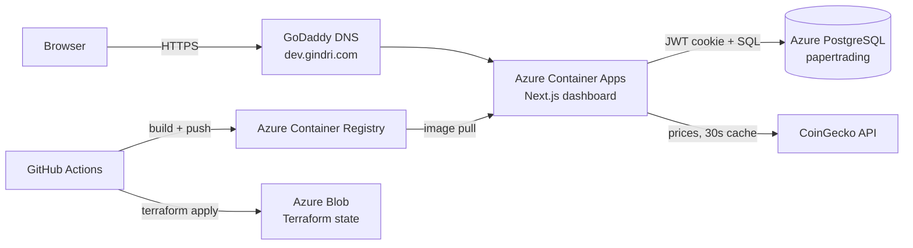
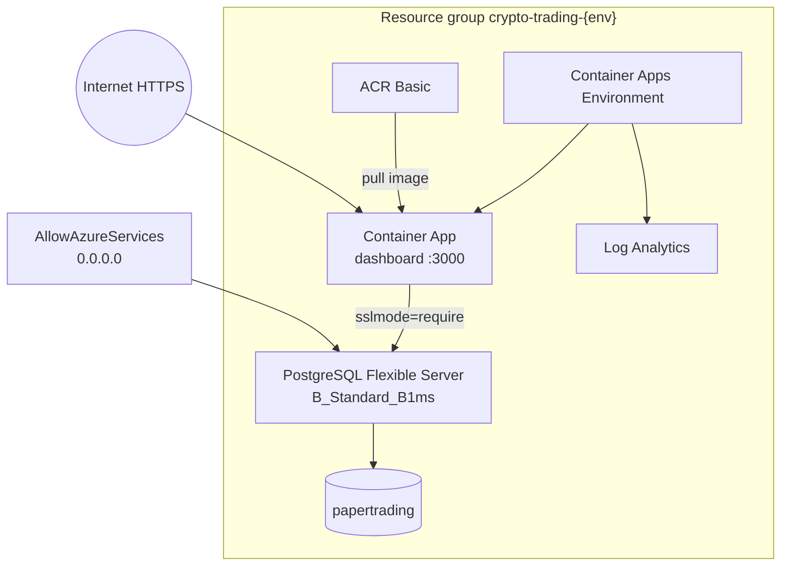
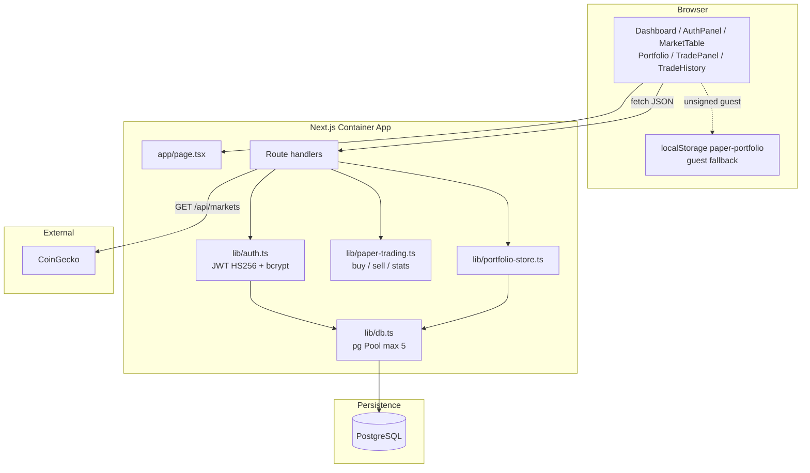
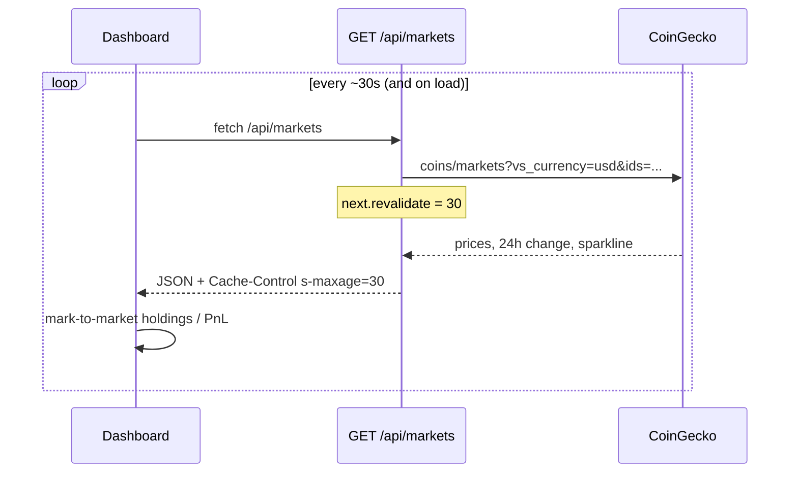
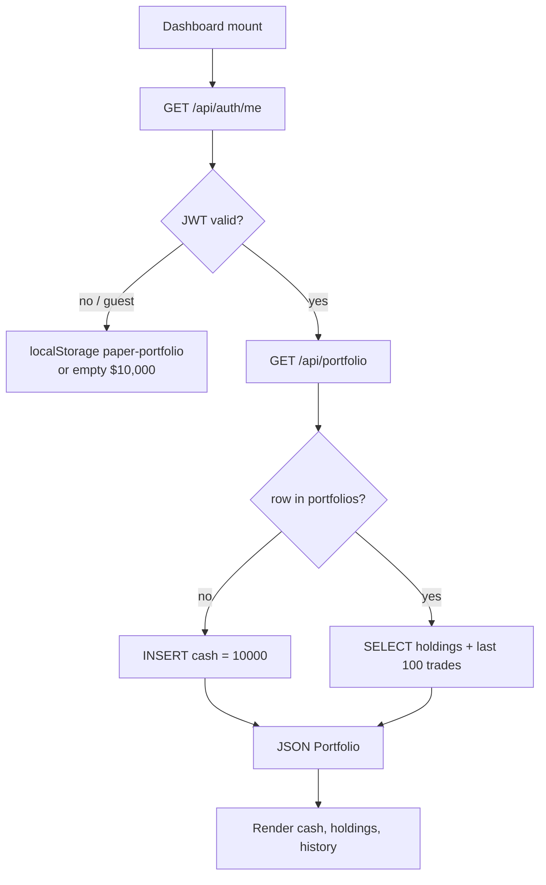
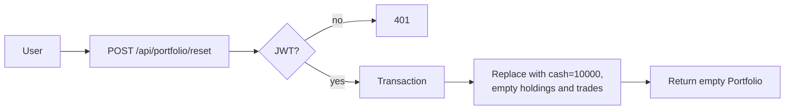
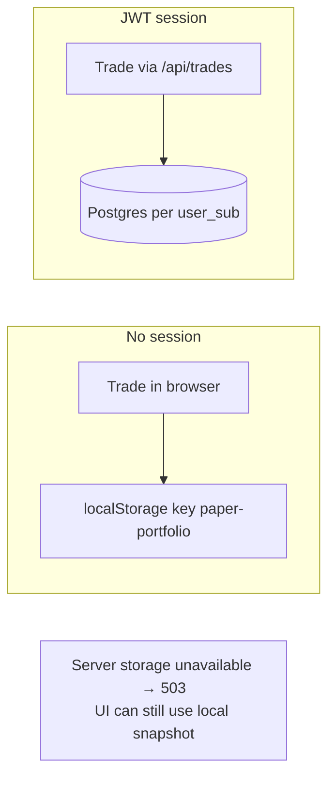
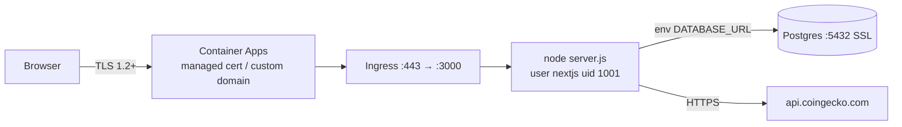
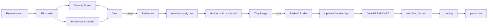
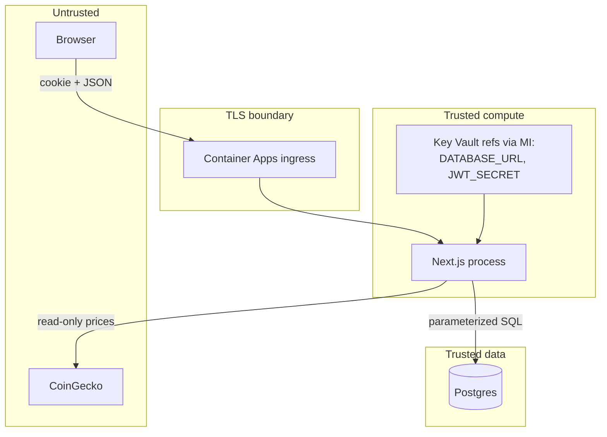

# High-level design and data flows

Paper-trading dashboard: Next.js app with JWT auth, Postgres history, and CoinGecko market prices. Deployed on Azure Container Apps via Terraform and GitHub Actions.

**Live (dev):** [https://dev.gindri.com](https://dev.gindri.com)

Related: [README](../README.md) · [Cyber Essentials](./cyber-essentials.md) · [ISO 27001](./ISO27001.md) · [Firewall rules](../azure/FIREWALL_RULES.md)

---

## 1. System context



| Actor / system | Role |
|----------------|------|
| Browser | UI, `httpOnly` JWT cookie `paper_id_token` |
| Next.js dashboard | Pages, API routes, paper-trade engine |
| Azure PostgreSQL 16 | Users, cash, holdings, trades |
| CoinGecko | Watchlist prices (server-side fetch) |
| GitHub Actions | Security scans, Terraform, image build/push |
| ACR | Dashboard container image |
| Log Analytics | Container Apps logs (30-day retention) |

---

## 2. Azure architecture (per environment)

Environments: `dev` (auto on merge to `main`), `staging` and `production` (manual workflow). Each env is an isolated resource group `crypto-trading-<env>` in `uksouth`.



| Resource | Name pattern | Notes |
|----------|--------------|-------|
| Resource group | `crypto-trading-{env}` | All app resources |
| Container App | `crypto-trading-{env}-app` | 1–2 replicas, 0.25 vCPU / 0.5Gi, non-root |
| Container Apps Environment | `crypto-trading-{env}-cae` | Ingress on port 3000 |
| ACR | `cryptotrading{env}acr` | Image `{name}:{git-sha}` |
| Postgres | `crypto-trading-{env}-pg` | Admin `paperadmin`; DB `papertrading` |
| Log Analytics | `crypto-trading-{env}-logs` | 30-day retention |
| Key Vault | `cryptotrading{env}kv` | `database-url`, `jwt-secret`, `signup-invite-code` |
| Managed identity | `crypto-trading-{env}-uai` | Key Vault Secrets User for Container App |

**Secrets** (Azure Key Vault → Container Apps secret references via user-assigned managed identity):

| Secret | Source | Injected as |
|--------|--------|-------------|
| `database-url` | Terraform `random_password.db` → Key Vault | `DATABASE_URL` |
| `jwt-secret` | Terraform `random_password.jwt` → Key Vault | `JWT_SECRET` |
| `signup-invite-code` | Terraform `random_password.signup_invite` → Key Vault | `SIGNUP_INVITE_CODE` |
| `acr-password` | ACR admin password (CA secret value) | registry pull |

Other env: `NODE_ENV=production`, `PORT=3000`, `HOSTNAME=0.0.0.0`, `AUTH_COOKIE_SECURE=true`.

---

## 3. Application layers



### API surface

| Method | Path | Auth | Purpose |
|--------|------|------|---------|
| GET | `/api/health` | No | Liveness `{ ok: true }` |
| GET | `/api/markets` | No | CoinGecko watchlist, 30s revalidate |
| GET | `/api/auth/me` | Cookie | Session user or `{ configured, user: null }` |
| POST | `/api/auth/signup` | No | Create user (password ≥ 12; invite when configured) |
| POST | `/api/auth/login` | No | Set JWT cookie, 7-day maxAge; lockout after failures |
| POST | `/api/auth/logout` | Cookie | Clear cookie |
| GET | `/api/portfolio` | Yes | Load or create portfolio (`$10,000` start) |
| POST | `/api/trades` | Yes | Buy/sell; persist in a transaction |
| POST | `/api/portfolio/reset` | Yes | Wipe holdings/trades, restore cash |

Watchlist IDs: bitcoin, ethereum, solana, ripple, cardano, dogecoin, polkadot, chainlink.

---

## 4. Data model

```mermaid
erDiagram
  users {
    text id PK
    text email UK
    text password_hash
    timestamptz created_at
    timestamptz disabled_at
  }
  portfolios {
    text user_sub PK
    numeric cash
    timestamptz updated_at
  }
  holdings {
    text user_sub PK_FK
    text coin_id PK
    text symbol
    text name
    numeric amount
    numeric avg_cost
  }
  trades {
    text id PK
    text user_sub FK
    text side
    text coin_id
    text symbol
    text name
    numeric quantity
    numeric price
    numeric total
    timestamptz created_at
  }
  users ||--o| portfolios : "id = user_sub"
  portfolios ||--o{ holdings : has
  portfolios ||--o{ trades : has
```

Schema is created on first query (`CREATE TABLE IF NOT EXISTS`). `holdings` and `trades` cascade-delete with the portfolio. Index: `trades_user_created (user_sub, created_at DESC)`. Trade history API returns the latest 100 rows.

JWT payload: `{ sub: user.id, email }`, algorithm HS256, expiry 7 days. Cookie: `paper_id_token`, `httpOnly`, `sameSite=lax`, `secure` when `AUTH_COOKIE_SECURE=true`.

---

## 5. Data flows

### 5.1 Sign up

```mermaid
sequenceDiagram
  actor User
  participant UI as AuthPanel
  participant API as POST /api/auth/signup
  participant Auth as lib/auth
  participant DB as PostgreSQL

  User->>UI: email + password (+ invite if required)
  UI->>API: JSON body
  API->>API: trim/lower email; password ≥ 12 + complexity
  API->>Auth: signUp(email, password, inviteCode)
  Auth->>Auth: validate invite when SIGNUP_INVITE_CODE set
  Auth->>DB: ensure users table
  Auth->>DB: SELECT id WHERE email
  alt email exists
    DB-->>UI: 400 already exists
  else new user
    Auth->>Auth: bcrypt.hash(password, 10)
    Auth->>DB: INSERT users (uuid, email, hash)
    API-->>UI: 200 { ok: true }
    UI->>UI: POST /api/auth/login (auto-login)
  end
```

### 5.2 Login and session

```mermaid
sequenceDiagram
  actor User
  participant UI as AuthPanel / Dashboard
  participant Login as POST /api/auth/login
  participant Me as GET /api/auth/me
  participant Auth as lib/auth
  participant DB as PostgreSQL

  User->>UI: email + password
  UI->>Login: JSON body
  Login->>Auth: signIn(email, password)
  Auth->>DB: SELECT user by email (reject if disabled_at set)
  Auth->>Auth: bcrypt.compare; record lockout on failure
  alt invalid or locked
    Login-->>UI: 401 / 429
  else valid
    Auth->>Auth: SignJWT HS256, exp 7d
    Login-->>UI: Set-Cookie paper_id_token
  end

  UI->>Me: cookie
  Me->>Auth: verifyIdToken
  Me-->>UI: { configured, user: { email, sub } }
```

Logout: `POST /api/auth/logout` sets the cookie `maxAge=0`.

### 5.3 Market data



The browser never calls CoinGecko directly. Failures return `502`.

### 5.4 Load portfolio



### 5.5 Place a trade (buy / sell)

```mermaid
sequenceDiagram
  actor User
  participant UI as TradePanel
  participant API as POST /api/trades
  participant Auth as getSessionUser
  participant Store as portfolio-store
  participant Engine as paper-trading
  participant DB as PostgreSQL

  User->>UI: side, coin, quantity
  UI->>API: { side, coin, quantity, price }
  API->>Auth: cookie JWT
  alt no session
    API-->>UI: 401
  else authenticated
    API->>Store: getOrCreatePortfolio(sub)
    Store->>DB: SELECT cash / holdings / trades
    API->>Engine: buy() or sell()
    alt validation fail
      Engine-->>UI: 400 e.g. not enough cash
    else ok
      API->>Store: saveUserPortfolio in transaction
      Store->>DB: DELETE holdings+trades; UPSERT cash; INSERT rows
      API-->>UI: updated Portfolio JSON
      UI->>UI: refresh stats from live prices
    end
  end
```

Engine rules (`lib/paper-trading.ts`):

| Side | Checks | Effect |
|------|--------|--------|
| Buy | quantity > 0, price > 0, cash ≥ total | Debit cash; add/average holding; prepend trade |
| Sell | holding exists, quantity ≤ amount | Credit cash; reduce/remove holding; prepend trade |

Totals rounded to 8 decimal places. Average cost on buy: `(avgCost × amount + total) / newAmount`.

### 5.6 Reset portfolio



### 5.7 Guest vs signed-in storage



---

## 6. Request path in Azure



Health: `GET /api/health` for platform probes. Postgres firewall: Azure services (`0.0.0.0`–`0.0.0.0`) plus optional CIDR — see [FIREWALL_RULES.md](../azure/FIREWALL_RULES.md).

---

## 7. CI/CD and image flow



Security Scans (every PR and push to `main`): Gitleaks + Trivy secrets, Trivy SCA, CodeQL (SAST), Trivy + Checkov + tfsec (IaC), Trivy container. OWASP ZAP also runs in Security Scans (soft on PR/push). **Blocking DAST** is `DAST after deploy (OWASP ZAP)` in Azure Deploy against `https://dev.gindri.com` after health checks. Deploy re-scans the image before ACR push. Secrets for the app come from Key Vault via managed identity.

---

## 8. Trust and trust boundaries



- Passwords ≥ 12 with complexity checks; bcrypt (cost 10); JWT never includes the hash. Optional invite-gated signup; `users.disabled_at` for operator disable; login lockout after repeated failures.
- SQL via parameterized `pg` queries; schema bootstrap is static DDL.
- Runtime image: Alpine patched, npm/yarn/corepack removed, non-root `nextjs`.
- No live exchange orders; cash and fills are simulated only.
