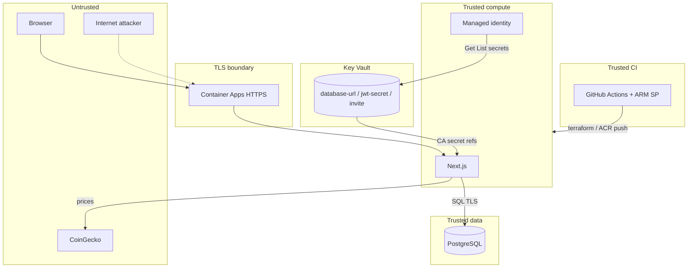

# STRIDE threat model — Crypto Trading Dashboard

Portfolio threat model for the Azure paper-trading stack. Method: **STRIDE** (Spoofing, Tampering, Repudiation, Information disclosure, Denial of service, Elevation of privilege).

Related: [HLD](./hld.md) · [Cyber Essentials](./cyber-essentials.md) · [ISO 27001](./ISO27001.md) · [DevSecOps pipeline](./devsecops-pipeline.md)

**Status:** Living document. Mitigations marked **Done** have repo/Azure evidence; **Partial** / **Open** are residual or roadmap.

---

## 1. Scope

| In scope | Out of scope |
|----------|--------------|
| Next.js dashboard on Azure Container Apps | CoinGecko availability / integrity (third party) |
| JWT + bcrypt auth, invite signup, lockout | Operator laptop / Entra MFA (Org — see CE) |
| Azure PostgreSQL Flexible Server (`papertrading`) | Live exchange execution (paper cash only) |
| ACR images, Terraform Blob state, GitHub Actions | Physical Azure datacentre controls |
| Public HTTPS ingress (`dev.gindri.com` and env FQDNs) | Staging/prod custom domains not yet bound |

**Primary users:** approved paper traders (invite), operator (Terraform / Azure Portal / GitHub).

---

## 2. Assets

| ID | Asset | Sensitivity |
|----|-------|-------------|
| A1 | JWT signing key (`jwt-secret` in Key Vault) | Critical |
| A2 | Postgres connection string (`database-url` in Key Vault) | Critical |
| A3 | User emails + bcrypt password hashes | High (PII) |
| A4 | Paper portfolios / trade history | Medium |
| A5 | Signup invite code | High |
| A6 | ACR images + admin pull credentials | High |
| A7 | Terraform state (Blob) | Critical |
| A8 | GitHub Actions ARM service principal | Critical |
| A9 | Session cookie `paper_id_token` | High |

---

## 3. Trust boundaries

Boundaries:

1. **Internet → ingress** — TLS terminated by Container Apps  
2. **App → Key Vault** — managed identity with Get/List access policy  
3. **App → Postgres** — `sslmode=require`; firewall Allow Azure Services + optional admin CIDRs  
4. **CI → Azure** — OIDC federated credentials (GitHub Environment → Entra app); no long-lived client secret  

---

## 4. STRIDE catalog

| ID | Element | Category | Threat | Impact | Likelihood | Mitigation | Status |
|----|---------|----------|--------|--------|------------|------------|--------|
| T-S1 | Login / JWT | Spoofing | Forge session cookie without valid secret | Account takeover | Low | HS256 JWT; secret in Key Vault; httpOnly cookie; `secure` flag | **Done** |
| T-S2 | Signup | Spoofing | Create accounts without approval | Unwanted users | Medium | Invite code required (`SIGNUP_INVITE_CODE`); public signup off in Azure | **Done** |
| T-S3 | ACR pull | Spoofing | Pull/run attacker image | RCE / data theft | Low | ACR + Trivy before push; tag = git SHA | **Partial** (ACR admin still on) |
| T-T1 | `/api/trades` | Tampering | Alter another user’s portfolio via IDOR | Integrity loss | Low | All portfolio/trade queries scoped by JWT `sub` | **Done** |
| T-T2 | SQL inputs | Tampering | SQL injection | Data breach | Low | Parameterized `pg` queries | **Done** |
| T-T3 | Terraform | Tampering | Malicious IaC change | Infra compromise | Medium | PR + Security Scans + Terraform plan; branch protection on `main` | **Done** |
| T-R1 | Auth events | Repudiation | Deny failed/successful logins | Weak forensics | Medium | App-level audit trail limited; Log Analytics holds container logs | **Partial** |
| T-I1 | Secrets at rest | Info disclosure | DB URL / JWT in plaintext CA secret store | Credential theft | Low | Key Vault + MI access policy; secrets not plaintext CA values | **Done** |
| T-I1b | Key Vault network | Info disclosure | KV public data plane (Allow ACL for CI) | Secret theft if leaked URL + weak auth | Medium | Access policies; harden with private endpoint + self-hosted runner later | **Partial** |
| T-I2 | Postgres network | Info disclosure | Scan/brute public Flexible Server | DB compromise | Medium | Password auth + Azure firewall; private VNet still open | **Partial** |
| T-I3 | `/api/markets` | Info disclosure | Public market data leak | Negligible | High (by design) | Public prices only; no PII | **Accept** |
| T-D1 | Ingress | DoS | Flood HTTPS / API | Availability loss | Medium | CA scale 1–2 replicas; Azure platform DDoS baseline | **Partial** |
| T-D2 | Login | DoS | Credential stuffing | Lockouts / noise | Medium | Lockout after 10 failures / 15 min | **Done** |
| T-E1 | App process | Elevation | Escape container as root | Host abuse | Low | Non-root `nextjs`; stripped npm/yarn | **Done** |
| T-E2 | Invite / disable | Elevation | Re-enable disabled user or steal invite | Unauthorized access | Low | `disabled_at`; invite only in Key Vault | **Done** |
| T-E3 | CI SP | Elevation | Stolen ARM_* secrets | Full env rewrite | Low | OIDC federated credentials (`id-token`); only client/tenant/subscription IDs in GitHub; branch protection | **Done** |

---

## 5. Risk register (priority)

| Priority | Threat IDs | Action |
|---------:|------------|--------|
| 1 | T-I2 | Private Postgres VNet + private DNS when networking budget allows |
| 2 | T-S3 / ISO 8.2 | Disable ACR admin; pull/push with managed identity |
| 3 | T-R1 / T-D1 | Auth audit events + alert rules on lockouts / 5xx |
| 4 | T-E3 | ~~OIDC for Actions~~ → done; rotate/delete any leftover `ARM_CLIENT_SECRET` |

---

## 6. Residual risks (accepted for this portfolio stack)

- Postgres remains **public** with Azure-services firewall (documented in [FIREWALL_RULES.md](../azure/FIREWALL_RULES.md)).  
- ACR **admin user** still used for CI docker login.  
- No **app MFA** (paper-trading demo; cloud MFA is Org / CE).  
- CoinGecko price integrity not verified (paper fills only).  

---

## 7. Mapping

| Framework | How this model helps |
|-----------|----------------------|
| Cyber Essentials | Secure configuration, access control, and boundary story for the app tier |
| ISO 27001 A.8.27 / risk | Architecture principles + explicit residual risks for SoA |
| OWASP ASVS / Top 10 | AuthZ, crypto, injection, SSRF-adjacent (outbound prices only) |
| DevSecOps pipeline | CodeQL / Trivy / Checkov / tfsec / Gitleaks / ZAP reduce likelihood of T-T* / T-I1 |

---

## 8. Review cadence

Revisit after: material architecture change (Key Vault, network, auth), production promote, or CE/ISO self-assessment refresh. Owner: repo maintainer.
